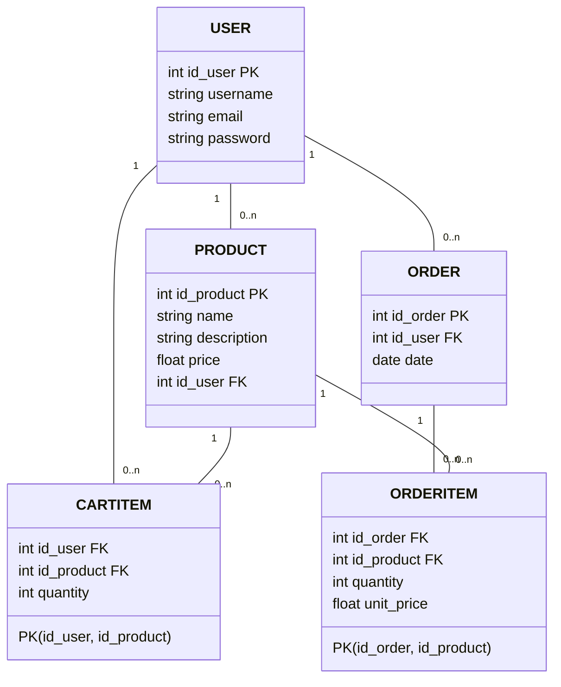

# 🛒 E-commerce API

API de e-commerce desenvolvida em **Java 17**, utilizando **Spring Boot**, **Gradle (Groovy DSL)**, **H2 Database** para testes locais e **PostgreSQL** no Railway para ambiente de produção.

---

## 🚀 Tecnologias Utilizadas

- **Java 17**
- **Spring Boot**
- **Gradle (Groovy DSL)**
- **H2 Database** (ambiente de desenvolvimento/testes)
- **PostgreSQL** (produção - Railway)
- **Spring Data JPA**
- **Spring Web**
- **Lombok**
- **Swagger / OpenAPI** (para documentação da API)

--- 

## 📊 Diagrama UML


## 📦 Configuração do Projeto

### Pré-requisitos

- [Java 17+](https://adoptium.net/)
- [Gradle](https://gradle.org/) (ou utilizar o *Gradle Wrapper* já incluso no projeto)
- [Docker](https://www.docker.com/) (opcional, para rodar PostgreSQL localmente)

### Clonar o projeto

```bash
git clone https://github.com/AndreCA1/Spring-Ecommerce.git
cd Spring-Ecommerce
