# 🛒 E-commerce API

API de e-commerce desenvolvida em **Java 17**, utilizando **Spring Boot**, **Gradle (Groovy DSL)**, **H2 Database** para testes locais e **PostgreSQL** no Railway para ambiente de produção.

---

## 🚀 Tecnologias Utilizadas

- **Java 17**
- **Spring Boot**
- **Gradle (Groovy DSL)**
- **H2 Database** (ambiente de desenvolvimento/testes)
- **PostgreSQL** (produção - Railway)
- **Spring Data JPA**
- **Spring Web**
- **Lombok**
- **Swagger / OpenAPI** (para documentação da API)

--- 

## 📊 Diagrama UML

```mermaid
   classDiagram
  direction TD
  class USER {
      int id_user PK
      string username
      string email
      string password
  }

  class PRODUCT {
      int id_product PK
      string name
      string description
      float price
      int id_user FK
  }

  class CARTITEM {
      int id_user FK
      int id_product FK
      int quantity
      PK(id_user, id_product)
  }

  class ORDER {
      int id_order PK
      int id_user FK
      date date
  }

  class ORDERITEM {
      int id_order FK
      int id_product FK
      int quantity
      float unit_price
      PK(id_order, id_product)
  }

  USER "1" -- "0..n" PRODUCT
  USER "1" -- "0..n" CARTITEM 
  PRODUCT "1" -- "0..n" CARTITEM 
  USER "1" -- "0..n" ORDER 
  ORDER "1" -- "0..n" ORDERITEM 
  PRODUCT "1" -- "0..n" ORDERITEM 
```


## 📦 Configuração do Projeto

### Pré-requisitos

- [Java 17+](https://adoptium.net/)
- [Gradle](https://gradle.org/) (ou utilizar o *Gradle Wrapper* já incluso no projeto)
- [Docker](https://www.docker.com/) (opcional, para rodar PostgreSQL localmente)

### Clonar o projeto

```bash
git clone https://github.com/AndreCA1/Spring-Ecommerce.git
cd Spring-Ecommerce
